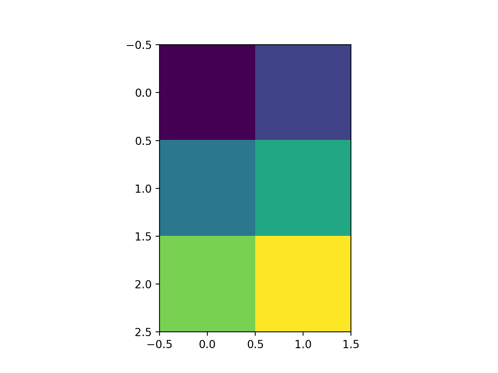

# 03_使用Python进行diy

> “python是最简单的编程语言”，仅限于有过其它编程语言经验的人。

[Python基础语法](../../收集&经验类/Python基础语法.md)

定义一个numpy矩阵：

```python
import numpy as np
a = np.zeros([3,2])

# 输出：
"""
[[0. 0.] 
 [0. 0.] 
 [0. 0.]]
"""
```

```python
a[0, 0] = 1
a[0, 1] = 2
a[1, 0] = 9
a[2, 1] = 12
print(a)

# 输出
"""
[[ 1.  2.]
 [ 9.  0.]
 [ 0. 12.]]
"""
```


##### 安装 matplotlib.pyplot 库

```
pip install matplotlib -i https://pypi.tuna.tsinghua.edu.cn/simple
```

结合之前的代码

```python
import matplotlib.pyplot as plt
import numpy as np
import random

a = np.zeros([3,2])
step = 0

for i in range(len(a)):
    for j in range(len(a[i])):
        # 0~1的随机数
        # a[i][j] = random.random()
        a[i][j] = step
        # python只能+=自增，无法使用++代替
        step += 1
plt.figure()
plt.imshow(a, interpolation="nearest")
plt.show()
```



## 2.4 使用Python制作神经网络

### 框架代码

神经网络类至少有三个函数：

- 初始化函数——设定输入层节点、隐藏层节点和输出层节点的数量
- 训练——学习给定训练集样本后，优化权重。
- 查询——给定输入，从输入节点给出答案。

```python
# 定义神经网络类
class neuralNetwork:
    # 初始化神经网络
    def __init__(self):
        pass
    # 训练神经网络
    def train(self):
        pass
    # 查询神经网络
    def query(self):
        pass
    pass
```

可以在这个框架上充实神经网络工具的详细细节了

### 初始化网络

```python
# 定义神经网络类
class neuralNetwork:
    # 初始化神经网络
    def __init__(self, nodes_info, learning_grate):
        # 输入层、隐藏层、输出层
        self.nodes_input = nodes_info['input']
        self.nodes_hide = nodes_info['hide']
        self.nodes_output = nodes_info['output']

        # 学习率
        self.lr = learning_grate
        pass
    # 训练神经网络
    def train(self):
        pass
    # 查询神经网络
    def query(self):
        pass
    pass


# 节点信息
neural_node_info = {
    'input': 3,
    'hide': 3,
    'output': 3
}
# 学习率
learning_grate = 0.3

# 实例化一个神经网络对象
example = neuralNetwork(neural_node_info, learning_grate)
```

### 权重

- 在输入层与隐藏层之间的链接权重矩阵 W_{input_hidden}，大小为 hidden_nodes 乘以 input_nodes。
- 在隐藏层和输出层之间的链接权重矩阵 W_{hidden_output}，大小为hidden_nodes 乘以 output_nodes。

生成权重

```python
>>> import numpy as np
>>> np.random.rand(3, 3) # 生成 3x3 的矩阵，取值0~1之间的随机数
array([[0.563241  , 0.62260292, 0.15778703],
       [0.46246338, 0.06807223, 0.01097787],
       [0.95994308, 0.41391385, 0.52005121]])
>>> np.random.rand(3, 3) - 0.5 # 通过减去0.5，将范围限制于 -0.5 ~ 0.5
array([[ 0.14475536,  0.05044345,  0.06652133],
       [ 0.01072182, -0.29979282, -0.1379077 ],
       [-0.42418037,  0.2901734 ,  0.36071862]])
```

更进一步

```python
>>> np.random.uniform(-1/np.sqrt(3), 1/np.sqrt(3), size=(3, 3)) # 生成一个3x3的矩阵，取值范围 ±1/sqrt(3)
array([[-0.1008976 , -0.47066585,  0.54638584],
       [ 0.194984  ,  0.00094153, -0.54097934],
       [-0.55925325, -0.27252631, -0.12844234]])
>>> print(pow(3, -0.5), 1/np.sqrt(3))
0.5773502691896257 0.5773502691896258
```

最终

```python
class neuralNetwork:
    # 初始化神经网络
    def __init__(self, nodes_info, learning_grate):
        # 随机权重矩阵
        def random_weight_matrix(len1, len2):
            # 正态分布
            return np.random.normal(0.0, pow(len1, -0.5), (len1, len2))
            # return np.random.uniform(-1/np.sqrt(len1), 1/np.sqrt(len1), size=(len1, len2))

        # 输入层、隐藏层、输出层
        self.nodes_input = nodes_info['input']
        self.nodes_hide = nodes_info['hide']
        self.nodes_output = nodes_info['output']

        # 学习率
        self.lr = learning_grate

        # 输入层与隐藏层之间的权重矩阵
        self.w_ih = random_weight_matrix(self.nodes_hide, self.nodes_input)
        # 隐藏层与输出层之间的权重矩阵
        self.w_ho = random_weight_matrix(self.nodes_output, self.nodes_hide)
        pass
```

### 查询网络

```python
import numpy as np
import scipy.special as sp

# 随机权重矩阵
def random_weight_matrix(len1, len2):
    # 正态分布
    return np.random.normal(0.0, pow(len1, -0.5), (len1, len2))
    # return np.random.uniform(-1/np.sqrt(len1), 1/np.sqrt(len1), size=(len1, len2))


# 定义神经网络类
class neuralNetwork:
    # 初始化神经网络
    def __init__(self, nodes_info, learning_grate):
        # 输入层、隐藏层、输出层
        self.nodes_input = nodes_info['input']
        self.nodes_hide = nodes_info['hide']
        self.nodes_output = nodes_info['output']

        # 学习率
        self.lr = learning_grate

        # 输入层与隐藏层之间的权重矩阵
        self.w_ih = random_weight_matrix(self.nodes_hide, self.nodes_input)
        # 隐藏层与输出层之间的权重矩阵
        self.w_ho = random_weight_matrix(self.nodes_output, self.nodes_hide)
        
        self.activation_fn = lambda x: sp.expit(x)
        
        print('权重1：\n', self.w_ih, '\n权重2：\n', self.w_ho, '\n')
        
        
        pass
    # 训练神经网络
    def train(self):
        pass
    # 查询神经网络
    def query(self, input_list):
        # 将输入数组转为矩阵
        input = np.array(input_list, ndmin=2).T
        # 计算操作
        def output_calc(weight, input):
            return self.activation_fn(np.dot(weight, input))

        """ hidden_input = np.dot(self.w_ih, input)
        hidden_output = self.activation_fn(hidden_input)

        final_input = np.dot(self.w_ho, hidden_output)
        final_output = self.activation_fn(final_input) """

        return output_calc(self.w_ho, output_calc(self.w_ih, input))
    pass


# 节点信息
neural_node_info = {
    'input': 3,
    'hide': 3,
    'output': 3
}
# 学习率
learning_grate = 0.3

# 实例化一个神经网络对象
example = neuralNetwork(neural_node_info, learning_grate)
print('当前的计算结果：\n',example.query([1.0, 0.5, -1.5]))
```

输出

```
权重1：
 [[-0.14745388 -0.2056009  -0.29018929]
 [ 0.01591484 -0.04272739 -0.74752748]
 [ 1.48537997  1.53183857  0.24102601]]
权重2：
 [[ 0.59976696  1.1181515  -0.15747151]
 [-0.09223561 -0.42021885 -0.91274378]
 [ 0.49986701 -0.79254086 -0.47802417]]

当前的计算结果：
 [[0.7374891 ]
 [0.23870102]
 [0.32317084]]
```


### 训练网络

$$
\large error_{hidden} = weight^T_{hidden\_output}\cdot error_{output}
$$

$$
\large \Delta W_{j,k} = \alpha * E * sigmoid(O_k) * (1 - sigmoid(O_k)) * O^T_j
$$

```python
import numpy as np
from scipy import special as sp

# 随机权重矩阵
def random_weight_matrix(len1, len2):
    # 正态分布
    return np.random.normal(0.0, pow(len1, -0.5), (len1, len2))

# 转为矩阵
def convert_matrix(list):
    return np.array(list, ndmin=2).T

# 计算操作
def output_calc(weight, input, activation_fn):
    return activation_fn(np.dot(weight, input))

# 定义神经网络类
class neuralNetwork:
    # 初始化神经网络
    def __init__(self, nodes_info, learning_grate):
        # 输入层、隐藏层、输出层
        self.nodes_input = nodes_info['input']
        self.nodes_hide = nodes_info['hide']
        self.nodes_output = nodes_info['output']

        # 学习率
        self.lr = learning_grate

        # 输入层与隐藏层之间的权重矩阵
        self.w_ih = random_weight_matrix(self.nodes_hide, self.nodes_input)
        # 隐藏层与输出层之间的权重矩阵
        self.w_ho = random_weight_matrix(self.nodes_output, self.nodes_hide)

		# sigmoid 函数
        self.activation_fn = lambda x: sp.expit(x)

        print('权重1：\n', self.w_ih, '\n权重2：\n', self.w_ho, '\n')

    # 训练神经网络
    def train(self, input_list, target_list):
        input = convert_matrix(input_list)
        target = convert_matrix(target_list)

        # 算出误差（目标 - 结果）
        # 输出层误差
        output_error = target - self.final_output
        # 隐藏层误差
        hidden_error = np.dot(self.w_ho.T, output_error)

        # 通过误差修改
        self.w_ho += self.lr * np.dot((output_error * self.final_output * (1 - self.final_output)), np.transpose(self.hidden_output))
        self.w_ih += self.lr * np.dot((hidden_error * self.hidden_output * (1 - self.hidden_output)), np.transpose(input))

    # 查询神经网络
    def query(self, input_list):
        # 将输入数组转为矩阵
        input = convert_matrix(input_list)

        self.hidden_output = output_calc(self.w_ih, input, self.activation_fn)
        self.final_output = output_calc(self.w_ho, self.hidden_output, self.activation_fn)

        return self.final_output

# 节点信息
neural_node_info = {
    'input': 3,
    'hide': 3,
    'output': 3
}
# 学习率
learning_grate = 0.3

# 实例化一个神经网络对象
example = neuralNetwork(neural_node_info, learning_grate)
print('当前的计算结果：\n',example.query([1.0, 0.5, -1.5]))
```

