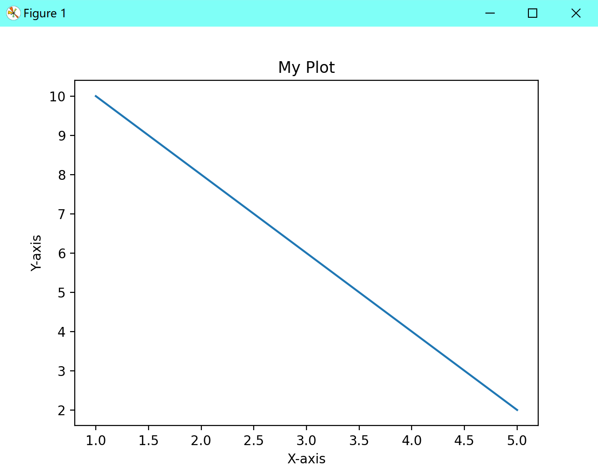

# Python库

[toc]

## 生成随机数random

```
import random
```

<<<<<<< HEAD
=======


>>>>>>> ebb6fc5 (completed)
生成0到1之间的随机浮点数：

```
random_number = random.random()
```


生成指定范围内的随机整数：

```
random_number = random.randint(start, end)
```

其中，start为范围的起始值，end为范围的结束值。


从给定的序列中随机选择一个元素：

```
<<<<<<< HEAD
import random
=======
>>>>>>> ebb6fc5 (completed)
random_element = random.choice(sequence)
```

其中，sequence为一个序列，可以是列表、元组等。


从给定的序列中随机选择多个元素：

```
<<<<<<< HEAD
import random
=======
>>>>>>> ebb6fc5 (completed)
random_elements = random.sample(sequence, k)
```


其中，k为需要选择的元素个数。


<<<<<<< HEAD
=======
## 使用os与系统交互

常用的`os`模块函数和方法：

1. 文件和目录操作：
   - `os.makedirs(path)`：递归创建目录。
   - `os.listdir(path)`：返回指定目录中的文件和目录列表。
   - `os.rename(src, dst)`：将文件或目录重命名。
   - `os.remove(path)`：删除指定的文件。
   - `os.rmdir(path)`：删除指定的空目录。
   - `os.path.exists(path)`：检查路径是否存在。
2. 进程管理：
   - `os.system(command)`：运行命令（命令可以是一个字符串或列表）。
   - `os.spawn(cmd, mode)`：创建一个新进程执行指定的程序文件。
   - `os.kill(pid, signal)`：向指定的进程发送信号。
3. 环境变量访问：
   - `os.environ`：一个包含环境变量的字典。
   - `os.getenv(var)`：获取指定环境变量的值。
   - `os.putenv(var, value)`：设置指定环境变量的值。

```python
import os

# 获取当前文件路径，不适用于交互式环境
current_path = os.path.abspath(__file__)
print(current_path)
```


>>>>>>> ebb6fc5 (completed)
## 使用matplotlib.pyplot绘制图形

```pip
pip install matplotlib -i https://pypi.tuna.tsinghua.edu.cn/simple
```

导入matplotlib.pyplot库。

```python
import matplotlib.pyplot as plt
```

创建一个图形窗口，可以使用`plt.figure()`函数。

```python
plt.figure()
```

绘制图形，可以使用`plt.plot()`函数。

```python
plt.plot(x, y)
```

其中，x和y分别是要绘制的数据的x轴和y轴的值。

添加标题、标签等，可以使用`plt.title()`、`plt.xlabel()`、`plt.ylabel()`等函数。

```python
plt.title('My Plot')
plt.xlabel('X-axis')
plt.ylabel('Y-axis')
```

显示图形，可以使用`plt.show()`函数。

```python
plt.show()
```

完整示例代码如下：

```python
import matplotlib.pyplot as plt

x = [1, 2, 3, 4, 5]
y = [10, 8, 6, 4, 2]

plt.figure()
plt.plot(x, y)
plt.title('My Plot')
plt.xlabel('X-axis')
plt.ylabel('Y-axis')

plt.show()
```

<<<<<<< HEAD

=======


## 使用hashlib算哈希

```Python
import hashlib

# md5
data = "Hello, world!"
md5_hash = hashlib.md5(data.encode()).hexdigest()
print(md5_hash)  # 输出：86fb269d190d2c85f6e0468ceca42a20

#  sha-1
sha1_hash = hashlib.sha1(data.encode()).hexdigest()
print(sha1_hash)  # 输出：2ef7bde608ce5404e97d5f042f95f89f1c232871

# sha-256
sha256_hash = hashlib.sha256(data.encode()).hexdigest()
print(sha256_hash)  # 输出：ad25d5ef9a99727946e7c75f913dee8a57491745e4d09509fda7a4404ed8e1b3
```

>>>>>>> ebb6fc5 (completed)
